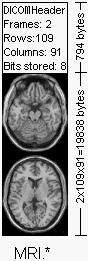
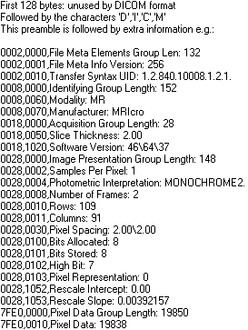
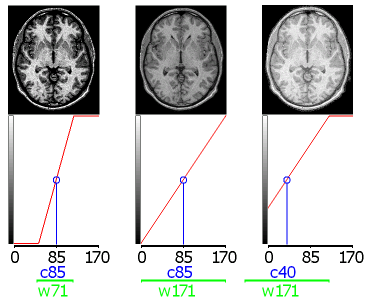
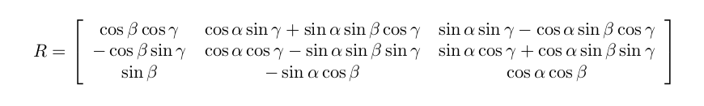
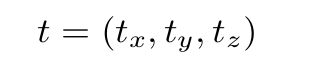

Title: Sistema no invasivo de detección temprana de la enfermedad de Alzheimer  
Author: Iñigo Sánchez Méndez  
Date: 04/12/2016  

# Borrador

## Objeto 

TFM documentation

## Functional MRI

Técnica no invasiva de estudio de la actividad del cerebro. Durante un experimento fMRI, son adquiridas una serie de imágenes del cerebro mientras el sujeto realiza una actividad. Los cambios en la señal medida entre las imágenes individuales se utilizan para hacer inferencias sobre las activaciones relacionadas con la tarea en el cerebro. Existen diferentes objetivos en el analisis de imágenes fMRI. Localizar regiones activas durante la actividad, hacer predicciones sobre estados sicológicos o de enfermedad...etc 

Los datos obtenidos comprenden una secuencia de imágenes de resonancia magnética. Cada uno de ellos consiste en una serie de volumenes uniformemente espaciados, o __voxels__, que dividen el cerebro en cajas de igual tamaño. Cada uno de los voxel contiene un valor de intensidad (¿qué representa?)

## Structural MRI

## DICOM Standard

Del Inglés _Digital Imaging and Communications in Medicine_ fué creado por _National Electrical Manufacturers Association_ para permitir la visualización y distribución de imágenes médicas.

Un único archivo DIMCO contiene la cabecera, la cuál contiene información sobre el nombre del paciente, el tipo de escaner, la dimensión de la imagen y otros metadatos, y todos los datos de la imagen. Puede ser comprimido a fin de reducir el tamaño de la imagen. 

### Cabecera DICOM

 La imagen a la izquierda muestra un hipotético archivo DICOM. En este ejemplo, los primeros 794 bytes son usados para el cabecera DICOM, la cual informa de la dimensión de la imagen y guarda otra información sobre el escaner. El tamaño de la cabecera puede variar en función de cuanta información se almacena en ella. En este caso se encuentra una imagen de 109x91x2 voxels, con una resolución de 1 byte por voxel (así el tamaño total de la imagen es de 19838 bytes). La imagen está a continuación de los datos de la cabecera, en el mismo archivo.  

DICOM reserva los 128 primeros bytes para el preambulo (el cual generalmente son todos ceros) seguido por los caracteres 'D', 'I', 'C' y 'M'. Tras estos caracteres aparece la información de la cabecera, el cual se organiza en 'grupos'. Por ejemplo el grupo '002hex' es el grupo de los metadatos del archivo, en el siguiente ejemplo contiene 3 elementos: una define la longitud del grupo, otro guarda la versión del archivo y el tercero almacena la sintaxis de transferencia <!--transfer sintax-->

Los elementos requeridos dependen del tipo de imagen, en la parte 3 del archivo DICOM de ejemplo aparece como 'MR' (0008:0060), por tanto tendrá que contener los elementos que describen un __MRI__. La ausencia de este elemento supone una violación del estandar.

Un elemento de particular importancia es __0002:0010__, el cual define el identificador único de transferencia de sintáxis __'Transfer Syntax Unique Identification'__ (ver tabla más abajo). Este valor informa la estructura de los datos de la imagen, revelando si los datos han sido comprimidos o no (lo que podría suponer perdidas en losdatos de altas frecuencias). 

|Transfer Syntax UID	| Definition |
| ------------------- | ---------- |
|1.2.840.10008.1.2 |	Raw data, Implicit VR, Little Endian |
|1.2.840.10008.1.2.x	| Raw data, Eplicit VR x = 1: Little Endian x = 2: Big Endian |
|1.2.840.10008.1.2.4.xx |	JPEG compression xx = 50-64: Lossy JPEG xx = 65-70: Lossless JPEG |
|1.2.840.10008.1.2.5	| Lossless Run Length Encoding |

Además de informar sobre la técnica de compresión (si existe), el UID de la sintaxis de transferencia informa del orden de los bytes de los datos sin procesar. Cada host puede almacenar de forma diferente los valores __integer__ (big endian and little endian ordering). Considere un entero de 16 bits con el valor 257: el byte más significativo almacena el valor 01 (= 255), mientras que el byte menos significativo almacena el valor 02. Algunas computadoras guardarán este valor como 01:02, mientras que otras lo almacenarán Como 02:01. Por lo tanto, para los datos con más de 8 bits por muestra, un visor DICOM puede necesitar cambiar el orden de bytes de los datos para que coincida con el orden utilizado por el equipo.

### Window center and window width (aka brightness and contrast)

La gente familiarizada con las imágenes médicas tipicamente hablan de 'window center' y 'window width' de una imagen. Es sólo una forma de describir el brillo y contraste de una imagen.

## Preprocesado de neuroimagen

El pipeline de preprocesado de neuroimagen depende generalmente del investigador que métodos y en que orden aplicar dichos métodos entre los siguientes

*. Slice Timing Çorrection (fMRI)
*. Motion Correction (fMRI)
*. Artifact detection (fMRI)
*. Corregistration
*. Normalization
*. Smoothing
*. Segmentation (sMRI) --> Regions Of Interest

### Registro

Usos más comunes:

- Combinar diferentes sujetos en un grupo de estudio
- Corrección del movimiento
- Cuantificar cambios estructurales

#### Tipos de registro de imagen:

- Según la complejidad en grados de libertad (df)
    - Cuerpos rígidos $(6 df)$
    - Affine $(12 df)$
    - No-lineal $(> 12 df)$
- Co-registro (la misma persona)
    - Sección cruzada (cross-sectional) $\rightarrow$ entre diferentes modalidades.
    - Longitudinal en la misma modalidad visita 1 a visita 2
    - Longitudinal entre diferentes modalidades visita 1 a visita 2
- Registrar una __template__
    - Es necesaria una __template__ (p. e. MNI T1)
    - Existen distintos tipos de templates
- Un sujeto en otro

#### Registro lineal: _Rigid_

Es el más simple. Tiene 6 grados de libertad y consisten en traslación y rotación: $$T_{rigid}(v) = Rv + t$$

Donde $v$ es un voxel en el epacio en 3D, esencialmente una matriz de rotación $R$ múltiplica el voxel $v$ y suma la traslación $t$. En otras palabras se obtiene la imagen, se rota y se traslada. Esta es una transformación de cuerpo rígido.

- Matriz de rotación:

- Vector de traslación 

Existen $6$ grados de libertad ya que hay 3 ángulos de rotación y 3 posibles ejes de traslación $x,y,z$. 

#### Registro lineal: _Affine_

La transformación affine tiene 12 grados de libertad. De la misma forma que la rígida, pero la matriz $A$ no se limita a una matriz de rotación, todos los valores pueden ser distintos en cada posición, no existen restricciones.
Es por esto que la matriz de transformación afín $A$ tiene 9 campos (una matriz de $3x3$) y el vector de traslación $3$, en total $12$ grados de libertad.
El vector de traslación es exactamente el mismo que el de la transformación de cuerpo rígido.
$$T_{affine}(v) = Av + t$$

Estás dos transformaciones lineales son las más utilizadas. 

#### Registro __No Lineal__

### Co-registro

Se obtienen mejores resultados con un menor número de grados de libertad. Esto es debido a que se rata del mismo cerebro, y por tanto no es necesario realizar grandes transformaciones para registrar un cerebro utilizando otro distinto.
Algunos ejemplos de análisis que no requieren plantillas de referencia ya que es suficiente con co-registrar las imágenes:
- Identificar cambios longitudinales específicos de la ubicación: cambios en un mismo cerebro para diferentes _visitas_. Es decir que a cambiado en un cerebro en particular.
- Segmentación. Suponiendo que estamos interesados en identificar la materia blanca, gris o el area correspondiente a una patología no es necesario utilizar una _template_. Es posible realizarlo y existen métodos relacionados, sin embargo no es necesario.
- Análisis de intensidades.

Existen muchos otros ejemplos en los que no es necesario aplicar esta técnica de preprocesado. Conviene evitarlo si es posible, aunque existen contextos en los que es necesario registrar las imágenes utilizando una _template_.

### Registro basado en una template

Asume que el cerebro puede ser manipulado en un espacio muestral dada una _template_. A menudo está cuestión es motivo de debate. No siempre es razonable por qué el cerebro es una estructura muy compleja.

Se obtiene información anatómica de la _template_, por ejemplo para poder identificar las regiones del cerebro.

Ejemplos de análisis que requieren utilizar esta técnica:
- Para obtener resultados de una población (p. e. localización de lesiones)
- Describir hallazgos a nivel anatómico
- Segmentación utilizando un multi-atlas. Obtener información del diferentes _templates_ de atlas cerebrales.

### Extracción del cerebro

- Preproceso previo al registro y segmentación.
- Elimina los tejidos que no son cerebrales.

Generalmente se elimina el fondo de la imagen para analizar los _slices_ de voxels.

## URLs de interés

1. R
    - [Special Volume on Magnetic Resonance Imagingin R ](file:///media/spolex/data_nw/Dropbox/master/TFM/special_volume_mri_R.pdf)
    - [CRANK View Medical Task Images](https://cran.r-project.org/web/views/MedicalImaging.html)
        
1. Python
    - [Read / write access to some common neuroimaging file formats](https://github.com/nipy/nibabel)
        There is some very limited support for DICOM. 
    - [Python programming language in the analysis of the neuroimaging data](http://nipy.org/packages/nibabel/index.html)
    - [PyMVPA is a Python package intended to ease statistical learning analyses of large datasets](http://www.pymvpa.org/)
    
    - [Nipype](http://miykael.github.io/nipype-beginner-s-guide/index.html)
        
1. C
    - [lipsia](http://www.cbs.mpg.de/institute/software/lipsia)
    
1. Scripting
    - [FreeSurfer](https://surfer.nmr.mgh.harvard.edu/)
    - [FreeSurfer tutorials](https://surfer.nmr.mgh.harvard.edu/fswiki/FreeSurferBeginnersGuide)
    - [FSL](https://fsl.fmrib.ox.ac.uk/fsl/fslwiki/FSL)
    - [FSL course](http://fsl.fmrib.ox.ac.uk/fslcourse/)
    - [NeuroDebian](http://neuro.debian.net/index.html)

#### DICOM 

1. Estandar
    - [The DICOM Standard](http://www.cabiatl.com/mricro/dicom/index.html)

1. Python
    - [Pure python package for DICOM medical file reading and writing](https://pypi.python.org/pypi/pydicom)
    - [pydicom Documentation](http://pydicom.readthedocs.io/en/latest/index.html)
    - [dcm2niix – converts DICOM and PAR/REC files into the NIfTI format](http://neuro.debian.net/pkgs/dcm2niix.html#binary-pkg-dcm2niix)

#### DATASETS    
1. [OpenfMRI](https://openfmri.org/data-processing-stream/)
1. [NeuroDebian](http://neuro.debian.net/pkglists/toc_pkgs_for_release_data.html)

# Glosario

[**Voxel**](https://es.wikipedia.org/wiki/V%C3%B3xel)
[**Slice**]